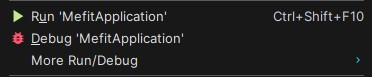
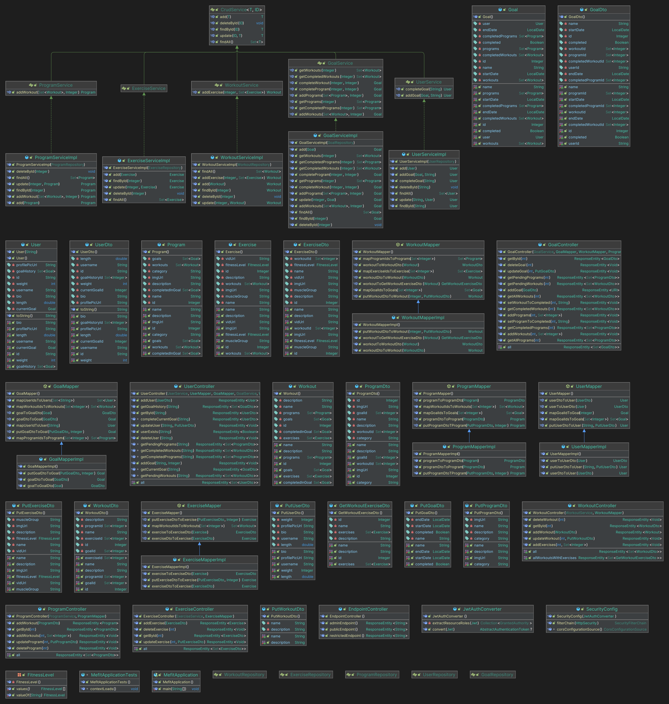

# MeFIT server
## Introduction

Welcome to the Backend Component of the Collaborative Case Project!

As we embark on this journey, we're entering the realm of real-world work environments, where collaboration is key. This four-week immersive experience was an essential part of our final course, where we joined an assigned team of fellow full-stack development candidates to mirror the dynamics of professional project teams.

Our primary focus during this endeavor was the successful execution of a client's project. This period challenged our teamwork, problem-solving, and integration of backend development skills.

It's important to note that our team's composition was different, with some groups including UX/UI design candidates, backend candidates, while some others consist exclusively of full-stack developers. However, the core essence of collaborative innovation remained constant. Every team member played a crucial role in bringing the project to life.

In this journey, be prepared to leverage the power of teamwork and technical prowess.

<br>
<br>
<div align="center">
  <center></center>
</div>
<br>
<br>

## Learning Outcomes

### For Full-Stack Development Candidates:

**_Project Insight:_** Demonstrate insight into industry-relevant project planning, prototyping, and deployment standards.

_**Problem-Solving:**_ Apply development knowledge to address problems and issues within an industry-relevant project brief.

_**Research Skills:**_ Find information and materials that are pertinent to the project's requirements.

_**Scope Understanding:**_ Study a project brief's scope, identify measures to optimize results, and meet deadlines effectively.

_**Group Collaboration:**_ Plan and execute a development brief, catering to the needs of selected audiences, as part of a collaborative group.

_**Teamwork:**_ Build strong relationships with peers and collaborate on solving development brief challenges.

### For UX/UI Candidates:

_**UX Design Standards:**_ Demonstrate insight into industry-relevant UX design standards, encompassing project preparation, presentation, and delivery. Application of Knowledge: Apply user experience and user interface knowledge to address issues within an industry-relevant project brief.

_**Effective Research:**_ Efficiently locate relevant information and materials needed for the project.

_**Scope Analysis:**_ Analyze a project brief's scope, identifying potential user experience and delivery issues, and implement measures for optimization and timely completion.

_**Group-Based UX Design:**_ Plan and execute UX design solutions based on the needs of selected audiences within collaborative group projects. Interdisciplinary Collaboration: Build relationships with peers across different disciplines, project stakeholders, participants, and fellow UX/interaction designers.

_**Work Methods and Products:**_ Develop work methods and products relevant to the UX Design process.
These learning outcomes reflect the key skills and competencies that full-stack development and UX/UI candidates will gain through the successful completion of the project.

## Project Overview

Welcome to MeFIT, your fitness companion for achieving and maintaining your workout goals. MeFIT is a collaborative full-stack development project designed to empower individuals on their fitness journeys.

**Key Features:**

- _**Personalized Workout Regimens:**_ Tailor your exercise preferences and goals. MeFIT's intelligent algorithm generates a custom workout plan just for you.

- _**Goal Tracking:**_ Set weekly workout goals, and track your progress in real-time with visual feedback to stay motivated.

- _**Comprehensive Exercise Library:**_ Access a variety of exercises with descriptions, images, and videos to ensure correct and efficient execution.

- _**Community Support:**_ Join a supportive fitness community to stay motivated, receive encouragement, and explore new exercises.

- _**User-Centric Design:**_ MeFIT offers an intuitive and seamless user experience across devices, making fitness accessible wherever you are.

No more struggling with inconsistent routines, boredom, or lack of motivation. MeFIT is your solution to staying accountable, motivated, and injury-free on your fitness journey.

Join us today and experience the power of MeFIT as your trusted companion to a fitter, healthier you.

## Project Structure

```Bash
├───.mvn
│   └───wrapper
├───.vscode
├───assets
│   └───imgs
├───src
│   ├───main
│   │   ├───java
│   │   │   └───se
│   │   │       └───experis
│   │   │           └───com
│   │   │               └───mefit
│   │   │                   ├───config
│   │   │                   ├───controller
│   │   │                   ├───mapper
│   │   │                   │   ├───abstracts
│   │   │                   │   └───implementations
│   │   │                   ├───model
│   │   │                   │   └───DTOs
│   │   │                   │       ├───ExerciseDtos
│   │   │                   │       ├───GoalDtos
│   │   │                   │       ├───ProgramDtos
│   │   │                   │       ├───UserDtos
│   │   │                   │       └───WorkoutDtos
│   │   │                   ├───repository
│   │   │                   └───service
│   │   │                       ├───implementations
│   │   │                       └───interfaces
│   │   └───resources
│   └───test
│       └───java
│           └───se
│               └───experis
│                   └───com
│                       └───mefit
└───target
├───classes
│   └───se
│       └───experis
│           └───com
│               └───mefit
│                   ├───config
│                   ├───controller
│                   ├───mapper
│                   │   ├───abstracts
│                   │   └───implementations
│                   ├───model
│                   │   └───DTOs
│                   │       ├───ExerciseDtos
│                   │       ├───GoalDtos
│                   │       ├───ProgramDtos
│                   │       ├───UserDtos
│                   │       └───WorkoutDtos
│                   ├───repository
│                   └───service
│                       ├───implementations
│                       └───interfaces
└───generated-sources
└───annotations
```
<br>

## Features

- **CRUD Operations**: Perform **C**reate, **R**ead, **U**pdate, and **D**elete operations on programs, workouts, exercises and goals.
- **Relational Data**: View relationships between programs, workouts, exercises and goals to accurately represent their
  associations.
- **Reports**: Generate insightful reports, such as getting all programs, workouts, exercises to be able to set a weekly goal.
- **Documentation**: Utilize the Swagger/OpenAPI documentation to understand and interact with the API.

<br>

<div align="center">
<center><h2 align="center">ER Diagram</h2></center>
</div>
<br>
<div align="center">
<center></center>
</div>
<br>

## Requirements

> Check out the detailed [requirements](https://github.com/GustafHasselgren/mefit-backend/milestones) for the entire project
<br>

## Getting started

Before you begin, make sure you have the following tools and software installed:

### Prerequisites

- [IntelliJ IDEA](https://www.jetbrains.com/idea/)
  or [Visual Studio Code (VSCode)](https://code.visualstudio.com/Download) => Open and select the cloned
  directory repo by following (File/Open folder) from the menu above or ctrl + N + O (windows).
  Recommended extensions
  are [Java](https://www.oracle.com/java/technologies/downloads/), [Maven](https://maven.apache.org/)
  or [Gradle](https://gradle.org/releases/), [Extension Pack for Java](https://marketplace.visualstudio.com/items?itemName=vscjava.vscode-java-pack)
- [Docker](https://www.docker.com/get-started) to replicate the development environment.
- A [PostgreSQL](https://www.postgresql.org/download/) database instance (you can use Docker to set this up).
- A [GitLab](https://about.gitlab.com/) or [GitHub](https://github.com/login) account to store and collaborate on your
  project code.

This section will guide you through setting up your development environment, installing dependencies, and running
the Film API project locally.

* [Git](https://git-scm.com/) => [installation instructions](https://www.atlassian.com/git/tutorials/install-git)
    * [Add your Git username and set your email](https://docs.gitlab.com/ce/gitlab-basics/start-using-git.html#add-your-git-username-and-set-your-email)
        * `git config --global user.name "YOUR_USERNAME"` => check `git config --global user.name`
        * `git config --global user.email "email@example.com"` => check `git config --global user.email`
    * > **Windows users**: To use the [Git Bash](https://www.atlassian.com/git/tutorials/git-bash) (**recommended**)
      shell from your Git installation or the Bash shell from
      the [Windows Subsystem for Linux](https://docs.microsoft.com/en-us/windows/wsl/install-win10) to run all shell
      commands for this project.
* [GitHub](https://www.google.se/url?sa=t&rct=j&q=&esrc=s&source=web&cd=&cad=rja&uact=8&ved=2ahUKEwiDlrjRtpyBAxWdVPEDHZ5GDJ8QFnoECBcQAQ&url=https%3A%2F%2Fgithub.com%2Flogin&usg=AOvVaw0YPQjBCLvq4nLugtBaJju7&opi=89978449) => Login to your account with your **gitHub credentials**.
    * [Setup SSH key with GitHub]
        * Create an SSH key pair `ssh-keygen` by following the [instructions](https://docs.github.com/en/authentication/connecting-to-github-with-ssh/generating-a-new-ssh-key-and-adding-it-to-the-ssh-agent) for all
          OS (skip if you already have one),
        * Add your public SSH key to your GitlHub profile under ./settings/access/SSH-and-GPG-keys by following the [instructions](https://docs.github.com/en/authentication/connecting-to-github-with-ssh/adding-a-new-ssh-key-to-your-github-account),
        * Make sure the email you use to commit is registered under ./edit profiles/emails in gitlab.
* [GitLab](https://gitlab.com/users/sign_in/) => Login to your account with your **gitlab credentials**.
    * [Setup SSH key with Gitlab]
        * Create an SSH key pair `ssh-keygen` by following the [instructions](https://docs.gitlab.com/ee/ssh/) for all
          OS (skip if you already have one),
        * Add your public SSH key to your Gitlab profile under ./edit profiles/SSH keys,
        * Make sure the email you use to commit is registered under ./edit profiles/emails in gitlab.

### Setting Up the Environment

#### Setting Java Path in Windows

- Go to the Search box and type advanced system settings in it. Now click on the View advanced system settings.
- Select the Advanced tab and then click environment variables.
- In the system, variables click the New button. Now in the edit system variable, type variable name as JAVA_HOME and
  variable path as the path where the JDK folder is saved and click on OK button Usually the path of the JDK file will
  be C:\Program Files\Java\<java-version>
- Now in the system variables go to the path and click the edit button.
- Click the New button.
- Now add the following path: %JAVA_HOME%\bin

#### Installing Apache Maven

The installation of Apache Maven is a simple process of extracting the archive and adding the bin directory with the mvn
command to the PATH.

Detailed steps are:

- Have a JDK installation on your system. Either set the JAVA_HOME environment variable pointing to your JDK
  installation or have the java executable on your PATH.
- Extract/copy distribution archive in any directory (good practice is to copy into "C\:", i.e. _C:
  \tools\apache-maven-3.9.3-bin_)

```Bash
unzip apache-maven-3.9.4-bin.zip
```

or

```Bash
tar xzvf apache-maven-3.9.4-bin.tar.gz
```

- Add the bin directory of the created directory apache-maven-3.9.4 to the PATH environment variable,

  Right click on MyComputer -> properties -> Advanced System Settings -> Environment variables -> click new button

  Now add MAVEN_HOME in variable name and path of maven in variable value. It must be the home directory of maven
  i.e. outer directory of bin. For example: E:\apache-maven-3.1.1 .


- Confirm with mvn -v in a new shell. The result should look similar to

```Bash
Apache Maven 3.9.4 (dfbb324ad4a7c8fb0bf182e6d91b0ae20e3d2dd9)
Maven home: /opt/apache-maven-3.9.4
Java version: 1.8.0_45, vendor: Oracle Corporation
Java home: /Library/Java/JavaVirtualMachines/jdk1.8.0_45.jdk/Contents/Home/jre
Default locale: en_US, platform encoding: UTF-8
OS name: "mac os x", version: "10.8.5", arch: "x86_64", family: "mac"
```

1. **Clone the Repository**: Clone this Git repository to your local machine using Git or your preferred
   version control tool as shown above.


2. **Open Project in IntelliJ IDEA**:
    - Launch IntelliJ IDEA.
    - Click on "Open or Import" and select the cloned repository folder.
    - Let IntelliJ build the project and set up the necessary configurations.

   ### Dependencies

   The project utilizes several dependencies to ensure seamless development and interaction with the database. Here are
   the key dependencies you'll find in the `pom.xml` file:

    <br>

    - Spring Boot Starter Web: `spring-boot-starter-web`
    - Spring Data JPA: `spring-boot-starter-data-jpa`
    - PostgreSQL Driver: `org.postgresql:postgresql`
    - Project Lombok: `org.projectlombok:lombok`
    - MapStruct: `org.mapstruct:mapstruct`

    <br>

   These dependencies are managed automatically by Maven, so you don't need to manually download or install them.


3. **Configure Database Settings**:
    - Open the `src/main/resources/application.properties` file.
    - Modify the following properties to match your PostgreSQL database configuration:
      ```
      spring.datasource.url=jdbc:postgresql://localhost:5432/your_database_name
      spring.datasource.username=your_database_username
      spring.datasource.password=your_database_password
      ```

4. **Run the Application**:
    - In IntelliJ IDEA, navigate to `SpringWebApiApplication.java` class.
    - Right-click on the class and select "Run 'MefitApplication'".



5. **Access API Documentation**:
    - Open your web browser and go to [http://localhost:8080/swagger-ui.html](http://localhost:8080/swagger-ui.html) to
      access the API documentation generated by Swagger.


6. **Explore the API**:
    - Use the Swagger UI to test the API endpoints and explore the available features.
    - Interact with programs, workouts, exercises and goals using endpoints.

### Running with Docker

If you prefer to run your PostgreSQL database instance in a Docker container, you can use the following command:

```bash
docker run --name <database_name> -e POSTGRES_PASSWORD=your_database_password -p 5432:5432 -d postgres
```

<br>


### Troubleshooting
If you encounter any issues while setting up your environment or running the application, please refer to the official
documentation of the tools used or consult the project's maintainers for assistance.

<br>
<br>

<br>
<div align="center">
  <center><h2 align="center">Class Diagram</h2></center>
</div>
<br>
<div align="center">
  <center></center>
</div>
<br>

## About Us

Fueling the project has been by a passionate team of student level fullstack developers — individuals [Ediz Genc](https://github.com/ediz-genc), [Gustaf Hasselgren](https://github.com/GustafHasselgren), [Linus Tareby](https://github.com/linusJtareby) and [Mahir Eziz](https://gitlab.com/Mahir-Eziz) who share a common vision for coding. Their dedication has led to the creation of a database and an interface to store and manipulate fitness-related data that reflects their journey as learners and creators.

## License

**Disclaimer:** This project is an educational exercise and is not intended for commercial use. It is developed under
the guidance of experts, adhering to copyright and legal guidelines of [MIT](https://choosealicense.com/licenses/mit/).
Rest assured, this project complies with legal standards and embodies ethical coding practices.
